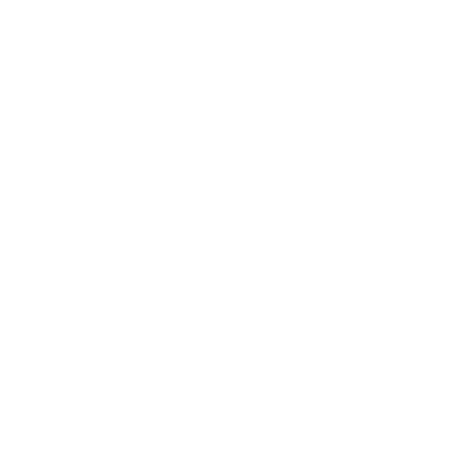

<!-- PROJECT LOGO -->
<div align="center">
  <!--  -->
  
  <h1 align="center">Proyek Aplikasi Tak Berdasar?</h1>
  
  <p align="center">
    Figma
    <br />
    <a href="https://www.figma.com/design/nzla7YyIxsZeU6zRntEvAe/UI---Prototype-UGM?node-id=0-1&t=XG68xd4RfhkPzaRh-1"><strong>📖 Lihat Design »</strong></a>
    <br />
    <br />
    <!-- <a href="#demo">Demo</a>
    ·
    <a href="#instalasi">Instalasi</a>
    ·
    <a href="#kontribusi">Kontribusi</a> -->
  </p>
</div>

---

## 🎨 Design

[](https://www.figma.com/design/nzla7YyIxsZeU6zRntEvAe/UI---Prototype-UGM?node-id=0-1&t=XG68xd4RfhkPzaRh-1)

Akses design lengkap di Figma melalui link di atas.

---

## 🚀 Instalasi

### Prerequisites

Pastikan Anda telah menginstall Node.js (versi 18 atau lebih tinggi)

### Quick Start

Pilih salah satu package manager favorit Anda:

<table>
<tr>
<th>📦 Package Manager</th>
<th>🔧 Commands</th>
</tr>
<tr>
<td>

**npm** ⭐ (Recommended)

</td>
<td>

```bash
npm install
npm dev
```

</td>
</tr>
<tr>
<td>

**yarn**

</td>
<td>

```bash
yarn install
yarn run dev
```

</td>
</tr>
<tr>
<td>

**pnpm**

</td>
<td>

```bash
pnpm install
pnpm dev
```

</td>
</tr>
</table>

Buka [http://localhost:3000](http://localhost:3000) di browser Anda untuk melihat hasilnya! 🎉

---

## 🔄 Git Workflow

### 📋 Pull & Push Schema

<div align="center">

</div>

| Step | Action                          | Description                  |
| ---- | ------------------------------- | ---------------------------- |
| 1️⃣   | `git checkout develop`          | Pindah ke branch develop     |
| 2️⃣   | `git pull origin develop`       | Pull perubahan terbaru       |
| 3️⃣   | `git checkout -b <branch-name>` | Buat branch baru             |
| 4️⃣   | `💻 Code`                       | Mulai coding!                |
| 5️⃣   | `git commit -m "message"`       | Commit perubahan             |
| 6️⃣   | `git pull origin develop`       | Pull lagi untuk sync         |
| 7️⃣   | `git push origin <branch-name>` | Push branch Anda             |
| 8️⃣   | `📝 Create PR`                  | Buat Pull Request ke develop |
| 9️⃣   | `🔔 Mention @bukunya`           | Tag Afif untuk review        |
| 🏁   | `✅ Done!`                      | Selesai!                     |

---

## 📝 Naming Conventions

### 🌿 Branch Naming

```
<type>.<short_description>.<nama_kamu>
```

**Types:**

- `feature` → Menambahkan fitur baru
- `fixing` → Memperbaiki bug/fitur

**Example:**

```bash
feature.navbar.afif
fixing.responsive-mobile.afif
```

### 💬 Commit Messages

```
<type>(<scope>): <short_summary>
```

**Format:**

- `<type>` → `feat` | `fix` | `docs` | `style` | `refactor`
- `<scope>` → Area yang diubah (opsional)
- `<summary>` → Deskripsi singkat dan jelas

**Examples:**

```bash
feat(homepage): add about section
fix(navbar): resolve mobile responsiveness
docs(readme): update installation guide
```

---

## 📁 Folder Structure

```
Lihat aja diatas, malas amat
```

---

## 📋 Coding Standards

### 🏷️ Naming Rules

| Type              | Convention       | Example                           |
| ----------------- | ---------------- | --------------------------------- |
| 📁 **Components** | PascalCase       | `Navbar.jsx`, `DefaultLayout.jsx` |
| 📄 **Files**      | camelCase        | `data.jsx`, `dataFaq.jsx`         |
| 🔧 **Variables**  | camelCase        | `createdAt`, `userName`           |
| 🎯 **Constants**  | UPPER_SNAKE_CASE | `API_URL`, `MAX_RETRY`            |

### 📏 File Extension

- Selalu gunakan `.ts` untuk konsistensi
- Komponen React menggunakan `.ts` (atau `.tsx`)

---

## 📚 Resources

### 🧹 Clean Code Guidelines

[](https://github.com/ryanmcdermott/clean-code-javascript)
[](https://gist.github.com/wojteklu/73c6914cc446146b8b533c0988cf8d29)

### 🛠️ Tech Stack


---

<div align="center">
  
### 🤝 Kontribusi

Ingin berkontribusi? Silakan baca guidelines di atas dan jangan ragu untuk membuat Pull Request!

**Made with ❤️ by Rayhan Ezfandyka Swagndy**

</div>
